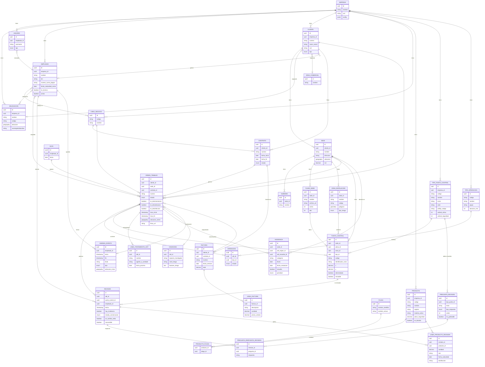

# Modelo de datos — Plataforma DDD (Argentina)

> Análisis del dump de referencia de iGEO (399 tablas) para extraer el núcleo del dominio **Control de Plagas (DDD: Desinfección, Desinsectación, Desratización)**.
> Este documento es solo referencia conceptual; la plataforma se construirá con schema propio.

## 1. Resumen

- **Total tablas analizadas**: 399
- **Formato dump**: TSV (tab-separated, strings entre comillas)
- **Multi-tenant**: casi todas las tablas tienen `empresa_id` (aislamiento por empresa)
- **Geolocalización**: coordenadas lat/lng en `sede` y `delegacion`; coordenadas X/Y sobre planos en `puntocontrol`; polígonos WKT en `zonainstalacion.geometria`
- **Volumen del cliente referencia**: 186k OTs, 2.4M revisiones, 5.9M respuestas de checklist, 44k puntos de control, 17k sedes, 8.9k clientes

## 2. Clasificación de tablas por dominio

| Dominio | Tablas clave | Incluir en MVP |
|---|---|---|
| **Multi-tenancy / Config** | `configuracionempresa`, `delegacion`, `usuario`, `usuario_role`, `usuariomultiempresa`, `configuracionempresa_role` | ✅ |
| **CRM** | `cliente`, `clientepotencial`, `cliente_empleado`, `sede`, `subsede`, `persona`, `zonacomercial`, `clasificacioncliente`, `origencliente` | ✅ |
| **Catálogo DDD** | `lineanegocio`, `producto`, `familia`, `plagaempresa`, `producto_plaga`, `tipooperacion`, `tipopuntocontrol`, `proveedor` | ✅ |
| **Operaciones DDD** | `ordendetrabajo`, `ordendetrabajo_empleado`, `ordendetrabajo_puntocontrol`, `ordendetrabajo_firmante`, `operacion`, `revision`, `lineatratamientoodt`, `lineaproductorevision`, `lineaproductotratamiento`, `apartadoodt` | ✅ |
| **Puntos de control (geo)** | `planosede`, `zonainstalacion`, `puntocontrol`, `detalleubicacionpuntocontrol`, `umbral`, `umbralespecie`, `umbraltipopuntocontrol` | ✅ |
| **Checklists** | `preguntarevision`, `preguntarespuestarevision`, `preguntachecklist`, `respuestachecklist`, `seccionchecklist`, `plantillapreguntachecklist`, `plantillaseccionchecklist` | ✅ |
| **Incidencias / Diagnosis** | `incidencia`, `incidenciacliente`, `diagnosis`, `lineapatogeno`, `fotografiaincidencia`, `deficienciacomunpersonalizada` | ✅ |
| **Empleados / Agenda** | `empleado`, `empleado_lineanegocio`, `empleado_delegacion`, `agendableusuario`, `horarioempleado`, `horarioordendetrabajo`, `registroasistencia`, `ruta`, `definicionderuta` | ✅ |
| **Almacén / Inventario** | `almacen`, `movimientoalmacen`, `lineamovimientoalmacen`, `inventario`, `lineainventario`, `articuloconsumible`, `recogidaresiduo` | Fase 2 |
| **Flota** | `unidadvehiculo`, `lineaunidadvehiculo`, `itv`, `seguro`, `permisocirculacion`, `sancionvehiculo` | Fase 2 |
| **Comercial** | `presupuesto`, `lineapresupuesto`, `presupuestoportada`, `tipopresupuesto`, `comision` | Fase 2 |
| **Contratos** | `contrato`, `contrato_cuentabancaria`, `mandato`, `cuentabancaria` | Fase 2 |
| **Facturación** | `factura`, `lineafactura`, `albaran`, `lineaalbaran`, `venta`, `lineaventa`, `recibo`, `remesasepa`, `seriefacturacion` | Fase 2 |
| **Compras** | `compra`, `lineacompra`, `pedidoproveedor`, `devolucionproveedor` | Fase 3 |
| **Documentos** | `plantillacertificado`, `modelocertificadopared`, `informetratamiento`, `informegraficable`, `plantillafactura` | Parcial |
| **Portal cliente** | `accesoportalcliente`, `accesoportalcliente_sede`, `fondologinportalcliente`, `configuracionpordefectoaccesoportalcliente` | Fase 3 |
| **Formación técnicos** | `alumno`, `curso`, `cursoimpartido`, `tituloformativo` | ❌ |
| **IGNORAR (Legionella/ACS/Piscinas)** | `circuitoacs`, `circuitohidromasajes`, `circuitotanque`, `enfriadorevaporativo`, `piscina`, `tanque`, `hidromasaje`, `librolegionela`, `librolegionelapdfgenerado`, `seccionlibrolegionela`, `evaluacionriesgo*`, `equipoppcl`, `historicoseccionlegio` | ❌ |
| **Auditoría/Integraciones** | `email`, `notificacion`, `token`, `microsoftoauthtoken`, `backupautomaticogenerado`, `exportacionempresa`, `envioverifactu` | ❌ |

## 3. Observaciones clave

### Multi-tenant
- Columna `empresa_id` en casi todas las tablas → aislamiento por tenant
- `usuariomultiempresa` permite a un usuario operar en varias empresas
- `delegacion` = sucursales dentro de una misma empresa (permite agrupar clientes/empleados/stock por sucursal)
- La tabla `configuracionempresa` define **~100 flags por tenant** (numeración facturas, horarios, flujos, integraciones)

### Geolocalización (3 niveles)
1. **Macro**: `sede.latitud/longitud`, `delegacion.latitud/longitud` → posición geográfica real
2. **Zonas internas**: `zonainstalacion.geometria` → polígonos (WKT/GeoJSON) dentro de una sede
3. **Puntos precisos**: `puntocontrol.x/puntocontrol.y` + `planosede` → coordenadas sobre imagen de plano

### Checklists dinámicos
- `preguntarevision` define las preguntas por `tipopuntocontrol` (52 tipos distintos en el dump)
- `preguntarespuestarevision` guarda la respuesta por revisión individual (5.9M filas → una respuesta por pregunta por revisión por punto)
- `tiporespuesta` indica si es booleano, numérico, texto, opción múltiple

### Carnés profesionales (Argentina)
- En `empleado` hay campos para: `numerocarneplagas`, `fechaexpedicioncarneplagas`, `fechacaducidadcarneplagas`
- Equivalente a ROPO en España. En Argentina lo gestiona **SENASA** (Aplicador/Director Técnico de Empresas de Control de Plagas)
- Hay campos análogos para legionella, fitosanitarios, xilófagos → solo mantengo "plagas"

### Productos biocidas (Argentina)
- `producto` tiene `registro`, `materiaactiva`, `porcenjatemateriaactiva`, `plazoseguridad`, `toxicidad`, `fabricante`
- En Argentina los biocidas se registran ante **ANMAT** (domisanitarios) y/o **SENASA**
- El número de registro es obligatorio para trazabilidad en libro de tratamientos

### Ciclo de vida de una OT (Orden de Trabajo)
1. `estado`: creada → asignada → en curso → finalizada → validada/cobrada
2. `estadoasignacion`: asignación automática por ruta (`ruta_id`) o manual
3. Campos DDD en la OT: `esdesinsectacion`, `esdesratizacion`, `esdesinfeccion` (booleanos)
4. Al cerrarse guarda: firma (`ficherofirma`), lat/lng cierre, IP cierre, DNI firmante, hora cierre
5. `operacion` = cada actuación concreta dentro de la OT (ej: "revisión trimestral", "tratamiento choque")
6. `revision` = inspección de un punto de control específico (con checklist + productos + incidencias)

### Agendableusuario (evento agenda)
- Tabla polimórfica de eventos de calendario (OTs, reuniones, vacaciones, etc.)
- `tipoentidad` + `identidad` apunta al objeto relacionado
- Tiene `latitudinicio/longitudinicio/latitudfin/longitudfin` para tracking

---

## 4. Tablas núcleo seleccionadas para MVP

### 4.1 Tenancy y acceso

#### `empresa` (tenant)
Inferida de `empresa_id` en casi todas las tablas. Datos en `configuracionempresa` + `delegacion`.
Campos clave: `id`, `nombre`, `cuit`, `config_*` (branding, numeración, horarios, integraciones).

#### `delegacion` (sucursal)
Sucursal operativa dentro de una empresa.
Campos clave: `id`, `empresa_id`, `nombre`, `codigo`, `direccion`, `localidad`, `provincia_id`, `lat`, `lng`, `cuit`, `numregistrobiocidas`, `zonahoraria`.

#### `usuario`
Credenciales de acceso, vinculado a un empleado.
Campos clave: `id`, `empresa_id`, `empleado_id`, `username`, `tipo` (admin/comercial/tecnico/cliente), `estadousuario`, `fechaultimaconexion`, `usaoffline`.

#### `empleado`
Persona física que opera (técnicos DDD, comerciales, administrativos).
Campos clave: `id`, `empresa_id`, `nombre`, `apellidos`, `dni`, `email`, `movil`, `almacen_id`, `preciohora`, `activo`, **carnés DDD**: `numerocarneplagas`, `fechaexpedicioncarneplagas`, `fechacaducidadcarneplagas`, permisos: `puedemoverpuntosdecontrol`, `puedefirmarantesdefinalizar`, etc.

### 4.2 CRM

#### `cliente`
Cliente contratante del servicio.
Campos clave: `id`, `empresa_id`, `delegacion_id`, `zonacomercial_id`, `gestionadopor_id` (empleado), `nombre`, `apellidos`, `tipocliente` (empresa/particular), `codigoidentificacion` (CUIT/DNI), `email`, `telefono`, `direccion`, `localidad`, `provincia_id`, `estado`, `numerodecliente`, `metodopago_id`, `riesgoeconomico`.

#### `sede`
Ubicación física donde se presta el servicio (un cliente puede tener N sedes).
Campos clave: `id`, `empresa_id`, `cliente_id`, `delegacion_id`, `zonacomercial_id`, `nombre`, `direccion`, `latitud`, `longitud`, `codigo`, `numerosede`, `estado`, `m2`, `m3`, `horarios`, `personacontacto`, `telefonopersonacontacto`, `idioma_id`, `distanciadelegacionsede`.

#### `subsede`
Sub-ubicación dentro de una sede (ej: pisos, edificios dentro de un complejo).
Campos clave: `id`, `empresa_id`, `sedecliente_id`, `nombre`, `codigo`, `descripcion`.

#### `zonacomercial`
Zona para asignación comercial/técnica.
Campos clave: `id`, `empresa_id`, `nombre`, `codigo`.

### 4.3 Catálogo DDD

#### `lineanegocio`
Tipo de servicio (DDD, Legionella, etc.). Para esta plataforma: solo líneas DDD.
Campos clave: `id`, `empresa_id`, `codigo`, `nombre`, `directortecnico_id`, `tienecertificadopropio`, `tienediagnosis`, `requieredirectortecnico`, `generapartedetrabajo`.

#### `producto` (biocida)
Producto aplicable (insecticida, rodenticida, desinfectante, herramientas, consumibles).
Campos clave: `id`, `empresa_id`, `codigo`, `nombre`, `nombrecomercial`, `fabricante`, `esbiocida`, `registro` (número registro ANMAT/SENASA), `materiaactiva`, `porcenjatemateriaactiva`, `plazoseguridad`, `toxicidad`, `metodoaplicacion`, `dosificacion`, `unidadmedidaventa_id`, `preciocompra`, `precioventa`, `obsoleto`, `estratamientoplagas`, `contienefichatecnica`, `contienefichadeseguridad`, `contieneregistrosanitario`.

#### `plagaempresa` / `producto_plaga`
Plagas que combate cada producto (M:N).

#### `tipopuntocontrol`
Categoría de dispositivo (cebadero rodenticida, trampa, lámpara UV, feromona, etc.).
Campos clave: `id`, `empresa_id`, `codigo`, `nombre`, `lineanegocio_id`, `color`, `icono`, `prefijocodigos`, `consumodelcebo`, `sereponeelcebo`, `umbralcriticotipopdc`, `umbralseguridadtipopdc`, `diasmaximocambioconsumible`, **atributos graficables** (hasta 5 custom numéricos por tipo).

#### `tipooperacion`
Tipo de servicio/actuación (revisión periódica, tratamiento choque, monitorización).
Campos clave: `id`, `empresa_id`, `codigo`, `nombre`, `grupo`, `subgrupo`, `periodicidad`, `duracion`, `tipoejecucion`, `instrucciones`.

### 4.4 Operaciones (el corazón del sistema)

#### `planosede`
Plano/imagen donde se ubican los puntos de control (PDF/PNG).
Campos clave: `id`, `empresa_id`, `sedecliente_id`, `nombre`, `ficherofoto`, `alto`, `ancho`, `tipoplano`, `fechaactualizacionptosdecontrol`.

#### `zonainstalacion`
Zona/área dentro de una sede (ej: "cocina", "depósito", "exteriores") con polígono.
Campos clave: `id`, `empresa_id`, `sedecliente_id`, `nombre`, `codigo`, `descripcion`, `geometria` (WKT/GeoJSON), `tiporiesgo`.

#### `puntocontrol`
Cebadero/trampa/dispositivo instalado en una ubicación específica.
Campos clave: `id`, `empresa_id`, `sedecliente_id`, `plano_id`, `zonainstalacion_id`, `tipopuntocontrol_id`, `codigo`, `identificadorunico`, `uuid`, `x`, `y` (sobre el plano), `modelo`, `tipoinstalacion`, `desinstalado`, `motivodesinstalacion`, `umbralcritico`, `umbralseguridad`, `revisable`, `generacodigoqrautomaticamente`, `codigodebarras`, `detalleubicacion_id`, `diascambioconsumible`, `fechaultimocambioconsumible`.

#### `ordendetrabajo` (OT)
Unidad de trabajo asignada a técnicos.
Campos clave: `id`, `empresa_id`, `cliente_id`, `sede_id`, `contrato_id`, `lineanegocio_id`, `ruta_id`, `numero`, `estado`, `estadoasignacion`, `tipoodt`, **flags DDD**: `esdesinsectacion`, `esdesratizacion`, `esdesinfeccion`, `diasemanabloqueo`, `horainiciobloqueo/horafinbloqueo`, `horainicioreal/horafinreal`, `notainterna`, `notapublica`, `completadopor_id`, `ficherofirma`, `personafirmante`, `dnipersonafirmante`, `latitudcierre`, `longitudcierre`, `ipcierre`, `horacierre`, `numerodeodtprevista`, `numtecnicosnecesariosservicio`.

#### `ordendetrabajo_empleado`
Empleados (técnicos) asignados a una OT (M:N).

#### `ordendetrabajo_puntocontrol`
Puntos de control que se van a revisar en esa OT (M:N).

#### `operacion`
Actuación concreta dentro de una OT (una OT puede tener varias operaciones).
Campos clave: `id`, `empresa_id`, `ordendetrabajo_id`, `tipooperacion_id`, `estado`, `nombre`, `duracion`, `instrucciones`, `motivocancelacion`.

#### `revision`
Registro de inspección de un punto de control individual durante una OT.
Campos clave: `id`, `empresa_id`, `ordendetrabajo_id`, `puntocontrol_id`, `empleado_id`, `fecha`, `hayincidencia`, `metodorevision`, `estadodeconservacion`, `secambiaelcebo`, `inaccesible`, `metodolectura`, `sesustituyedispositivo`, `datografica1`, `datografica2` (lecturas numéricas graficables).

#### `preguntarevision`
Pregunta de checklist asociada a un `tipopuntocontrol`.
Campos clave: `id`, `empresa_id`, `tipopuntocontrol_id`, `codigo`, `textopregunta`, `tiporespuesta`, `orden`, `esprincipal`, `esgraficable`, `respuestamultiple`, `numeromaximoderespuestas`, `valorpordefecto`.

#### `preguntarespuestarevision`
Respuesta concreta del técnico a una pregunta en una revisión.
Campos clave: `id`, `revision_id`, `codigopregunta`, `pregunta` (texto snapshot), `respuesta`, `orden`.

#### `lineatratamientoodt`
Tratamiento aplicado en una OT (con productos usados).
Campos clave: `id`, `empresa_id`, `ordendetrabajo_id`, `tratamiento_id`, `contratoid`, `nombre`, `descripcion`, `tipostratamientostring`, `agenteacombatir`, `fechaproximoservicio`, `indicacionesejecucion`.

#### `lineaproductorevision`
Producto biocida aplicado en una revisión puntual.
Campos clave: `id`, `revision_id`, `articulo_id` (producto), `cantidad`, `unidadmedida_id`, `lote`, `fechacaducidad`, `dosificacion`, `agenteacombatir`.

#### `incidencia`
Incidencia detectada en la sede (plaga encontrada, dispositivo dañado, deficiencia).
Campos clave: `id`, `empresa_id`, `sede_id`, `odtdondesecrea_id`, `odtdondeseresuelveid`, `categoria`, `tipoentidad`, `identidad`, `fecha`, `fecharesolucion`, `texto`, `medidacorrectora`, `resuelta`, `nivelprioridad`, `areaafectada`, `responsableincidencia`, `tratamientoasociado_id`, `agenteacombatir`.

#### `diagnosis`
Evaluación diagnóstica de situación (plagas presentes, factores de riesgo, medidas).
Campos clave: `id`, `ordendetrabajo_id`, `especieinvestigada`, `distribucion`, `riesgoinfectacion`, `urgenciadeactuacion`, `factoresriesgo`, `medidasdecontroldirectos`, `actividadroedores`, `especiesroedorespresente`, `resumenpasosrealizados`.

### 4.5 Agenda / ruteo

#### `agendableusuario`
Evento de calendario polimórfico (OT, reunión, ausencia).
Campos clave: `id`, `empresa_id`, `empleado_id`, `tipoentidad`, `identidad`, `tipoevento`, `fechainicio`, `fechafin`, `todoeldia`, `titulo`, `descripcion`, `color`, `lugar`, `lat/lng` (inicio y fin), `periodico`.

#### `ruta` / `definicionderuta`
Agrupación de OTs en una ruta de un técnico.
Campos clave: `empresa_id`, `empleado_id`, `fecha`, lista de OTs ordenadas.

### 4.6 Comercial / Facturación (Fase 2)

#### `presupuesto` / `lineapresupuesto`
Oferta comercial previa al contrato.

#### `contrato`
Acuerdo marco entre empresa y cliente con periodicidad.
Campos clave: `id`, `empresa_id`, `cliente_id`, `lineanegocio_id`, `presupuesto_id`, `fechainicio`, `fechafin`, `numero`, `estado`, `formacobro`, `formafacturacion`, `diasdefacturacion`, `diasdepago`, `renovable`, `numerofacturasaemitir`.

#### `factura` / `lineafactura`
Facturación emitida al cliente.

---

## 5. Diagrama ER del núcleo DDD (Mermaid)

## 6. Simplificaciones respecto a iGEO

Para el MVP de nuestra plataforma simplificamos así:

| En iGEO | En nuestra plataforma |
|---|---|
| ~100 flags en `configuracionempresa` | `Empresa.config jsonb` (solo los flags que realmente usemos) |
| Múltiples líneas de negocio (DDD, Legionella, ACS, Piscinas, Torres) | Solo **DDD** (modelo más limpio) |
| 13 tablas `tomadatos*` distintas | Una sola `toma_muestra` con `tipo` |
| 11 tablas `evaluacionriesgo*` | No incluir en MVP |
| Tablas `serie*` por entidad (numeración) | Una sola `serie_numeracion` con `tipo_entidad` |
| `agendableusuario` polimórfico | Una tabla `agenda_evento` con `odt_id` opcional + subtipos |
| `preguntarespuestarevision` con 5.9M filas | Mismo modelo pero con índice por `revision_id` y JSONB para respuestas complejas |
| Campos `facturae_*` (España) | Reemplazados por campos AFIP/ARCA (Argentina) |
| Carnés (plagas, legionella, fitosanitarios, xilófagos) | Solo `carne_plagas_numero` + `carne_plagas_vencimiento` (SENASA AR) |

## 7. Específicos Argentina

- **Autoridad**: SENASA (aplicadores/directores técnicos) + ANMAT (domisanitarios) + autoridad sanitaria provincial
- **Libro de tratamientos**: registro obligatorio de cada aplicación con producto, dosis, lote, superficie, técnico responsable, firma cliente
- **CUIT/CUIL** en vez de NIF/CIF
- **Facturación electrónica AFIP** (Factura A/B/C, tipo de comprobante, CAE)
- **Retenciones** (Ganancias, IVA, IIBB)
- **Zonas horarias**: `America/Argentina/*` (CABA, Mendoza, etc.)

## 8. Próximos pasos

1. Diseñar `schema.prisma` basado en este modelo
2. Generar migraciones iniciales PostgreSQL + PostGIS
3. Decidir estrategia multi-tenant: **schema-per-tenant vs single-schema con RLS por `empresa_id`** (recomendado: single-schema + RLS)
4. Levantar `docker-compose` con Postgres+PostGIS, MinIO (fotos), backend NestJS, frontend Next.js
5. Arrancar con CRUD Cliente → Sede → Puntos de control → OT → Revisión → Parte firmado PDF

